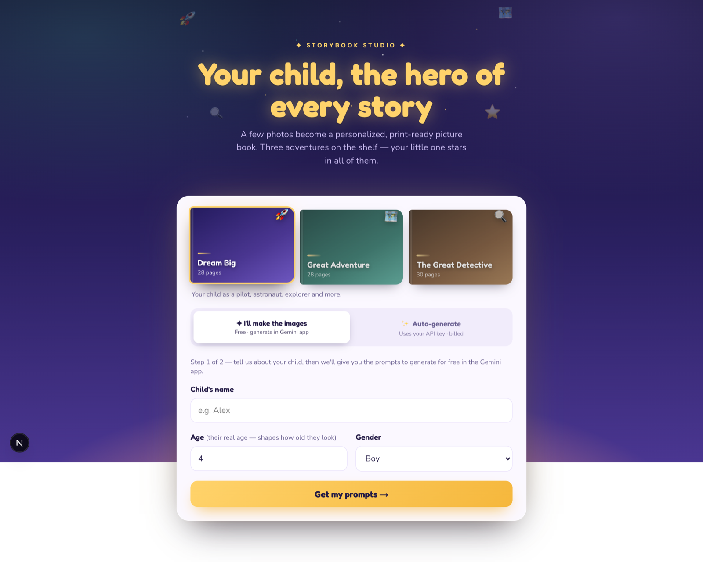

# Storybook Generator

Upload a few photos of a child and generate a **print-ready PDF picture book**
with the child illustrated as the hero on every page — in a landscape
picture-book format.

Illustrations are generated with Google **Gemini Nano Banana 2**
(`gemini-3.1-flash-image`), which keeps the child's likeness consistent across
every page using the uploaded photos (plus a one-time "character anchor"
portrait) as reference images.



## What you get

Finished, print-ready pages — the child illustrated as the hero on every page,
with the story woven into the art. Below is a sample book starring **Mia**, a
*fictional, illustrated character* (these are sample pages, not a real child):

|  |  |
| :---: | :---: |
|  |  |
|  |  |

## The books

Three storybooks ship in the registry — pick one in the UI or pass `--book` on
the CLI:

| Book id | Title | Print pages | Story |
| --- | --- | --- | --- |
| `dream-big` | Dream Big | 28 | Standalone career scenes — pilot, astronaut, explorer and more. |
| `great-adventure` | Great Adventure | 28 | One connected treasure-hunt journey with Scout the puppy. |
| `the-great-detective` | The Great Detective | 30 | A little detective tracks muddy footprints to crack the case of a missing yellow ball. |

The connected books use **two-page spreads** (one wide 21:9 illustration split
across facing pages). A spread-imposition guard (`lib/pdf/imposition.ts`) fails
fast if a spread would land across a page-turn instead of on facing pages.

## How the web app works

1. The upload form collects photos + the child's name, age, gender, and book.
2. `POST /api/generate` preprocesses the photos and starts a background **job**.
3. The orchestrator runs every page of the chosen book through Gemini (bounded
   concurrency), then Puppeteer assembles a print-ready landscape PDF.
4. The page polls `GET /api/jobs/:id` for progress and downloads the PDF from
   `GET /api/jobs/:id/pdf` when it's ready.

Because a book is 21–26 image calls (~1–3 minutes), generation is a polled job
rather than one blocking request.

## Privacy

Storybook Generator is **local-first**: you run it yourself, and there is no
hosted backend of ours that receives or stores anything. Uploaded photos are
held in memory only for the duration of a generation and are **never written to
disk** — only the generated artwork and the finished PDF are saved, on your own
machine.

Generating the illustrations does send the photos to **Google's Gemini API**
(or, on the free path, the Gemini web app), so they leave your machine for that
step and are subject to Google's data policies. Nothing else transmits them
anywhere. Use only photos you have the right to use, and the minimum needed for
a good likeness.

## Setup

```bash
# 1. Add your Gemini API key
cp sample.env .env.local
#   then edit .env.local and set GEMINI_API_KEY=...   (https://aistudio.google.com/apikey)

# 2. Run it
npm run dev
# open http://localhost:3000
```

Upload 3–5 clear, face-visible photos, enter a name/age/gender, pick a book,
and click **Create my storybook**. The PDF downloads automatically when done.

## Two ways to make a book

### 1. In the app: "I'll make the images" — free (uses your Gemini app quota)

Generate the illustrations yourself in the Gemini app (free on the Pro plan)
and feed them back in. No API charges.

Enter name/age/gender → copy the character-anchor prompt + per-page prompts →
generate them in the Gemini app → upload the images → download the PDF.

The same flow works from the CLI:

```bash
npm run prompts -- --name Mia --age 4 --gender girl --book the-great-detective
#   → writes <out>/mia/prompts.md + manifest.json + images/
#   generate each image, save as 01.png … NN.png in images/
npm run assemble -- --dir <out>/mia
#   → writes mia-the-great-detective.pdf
```

Missing pages fall back to a soft gradient, so a partial set still assembles.

### 2. In the app or CLI: "Auto-generate" — uses your `GEMINI_API_KEY` (billed)

Upload photos and every illustration is generated automatically via the Gemini
API. Convenient, but each book is ~21–26 billed image calls.

```bash
# Full batch generation for one child (character anchor + all pages + PDF):
npm run generate -- --name Mia --age 4 --gender girl \
  --book the-great-detective --photos "/path/to/photos" [--concurrency 8]

# Re-roll only specific printed pages from a previous run (copies the rest):
npm run regenerate -- --name Mia --book the-great-detective \
  --photos "/path/to/photos" --pages 1,17,30      # or --all
```

`generate` writes `00-character.*`, `01..NN` images, `manifest.json`,
`prompts.md`, and the PDF to `<STORYBOOK_OUT_DIR>/<child-slug>/`. `regenerate`
versions its output (`images-v2/`, `images-v3/`, …) and rebuilds the PDF.

## Configuration (`.env.local`)

| Variable | Default | Purpose |
| --- | --- | --- |
| `GEMINI_API_KEY` | — | Required for API generation. |
| `GEMINI_MODEL` | `gemini-3.1-flash-image` | Image model (Nano Banana 2). |
| `IMAGE_SIZE` | `2K` | Image tier: `1K` \| `2K` \| `4K`. |
| `GEMINI_SERVICE_TIER` | `flex` | `flex` (cheaper, slower) \| `standard` \| `priority`. |
| `GEMINI_TIMEOUT_MS` | `900000` | Per-request timeout (flex can queue for minutes). |
| `GEN_CONCURRENCY` | `1` | Pages generated in parallel. |
| `STORYBOOK_OUT_DIR` | `./storybook-out` | Where CLI runs save output. |

## Project layout

| Path | Purpose |
| --- | --- |
| `lib/story/registry.ts` | The book registry — every book, `buildPages`, filenames. |
| `lib/story/dreamBigTemplate.ts` | "Dream Big": 24 standalone career scenes. |
| `lib/story/greatAdventureTemplate.ts` | "Great Adventure": connected journey, spreads + per-scene lighting. |
| `lib/story/theGreatDetectiveTemplate.ts` | "The Great Detective": connected mystery, spreads + lighting. |
| `lib/gemini/imageClient.ts` | Gemini image wrapper (aspect ratios, retries, service tier). |
| `lib/images/preprocess.ts` | Downscales/normalizes photos with `sharp`. |
| `lib/generate/orchestrator.ts` | Runs pages through Gemini, builds the PDF. |
| `lib/generate/jobStore.ts` | In-memory job + progress state (POC). |
| `lib/pdf/page-template.ts` | HTML/CSS layout for every page (covers, verses, spreads). |
| `lib/pdf/imposition.ts` | Spread alignment guard (spreads must start on even pages). |
| `lib/pdf/buildBook.ts` | Renders the book to a print-ready PDF (Puppeteer). |
| `lib/config.ts` | Model id, print size, concurrency, art style. |
| `app/page.tsx` + `app/Studio.tsx` | Book shelf picker + the two flows. |
| `app/api/**` | `generate`, `prompts`, `assemble`, `jobs/:id`, `jobs/:id/pdf`. |
| `scripts/*.ts` | CLI: `prompts`, `assemble`, `generate`, `regenerate`. |

## Adding more storybooks

Books live in a registry, so a new one is a file + a line:

1. Create `lib/story/<yourBook>.ts` exporting a `StoryTemplate`
   (`{ id, title, subtitle, pages }`) — model it on an existing template.
2. Add it to `STORY_BOOKS` in `lib/story/registry.ts`.

Everything else updates automatically: the site's book shelf, and `bookId`
flows through generation, prompts, PDF, the APIs, and the CLI
(`npm run prompts -- --book <id>`, `npm run generate -- --book <id>`, …).

If the book uses spreads, keep every spread starting on an **even** print page
(the imposition guard will tell you if one doesn't) and the total page count
even so the back cover lands on the back.

## Tests

```bash
npm test
```

- Template, imposition, orchestrator (Gemini mocked), and page-template tests
  run fast.
- `lib/pdf/buildBook.test.ts` launches Puppeteer to confirm a real PDF is
  produced.

## Print specs

Landscape **11" × 8"** trim + 0.125" bleed, 300 DPI. Single pages are
full-bleed 3:2 illustrations; spreads are one 21:9 illustration split across
two facing pages. Tune in `lib/config.ts`.

## Deployment notes

This MVP is **local-first**. For Vercel: move the job store to a durable store
(e.g. Upstash KV), run generation on a background-capable function, and swap
Puppeteer for `@sparticuz/chromium` + `puppeteer-core`.
